# Arca Architecture

This document describes the internal architecture of Arca, a Docker Engine API implementation backed by Apple's Containerization framework.

## System Overview

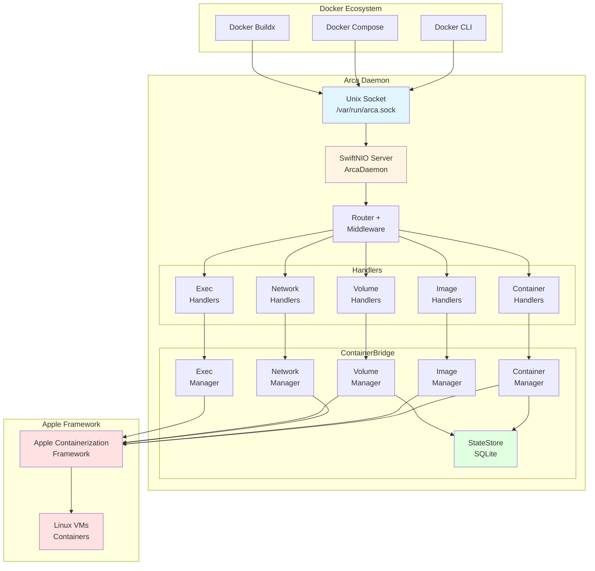

## Module Structure

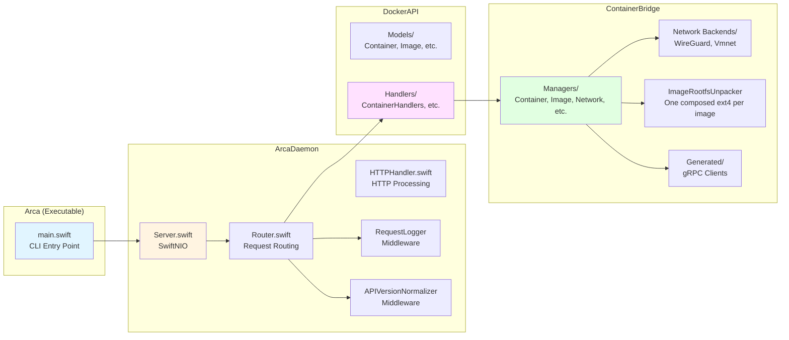

## Request Flow

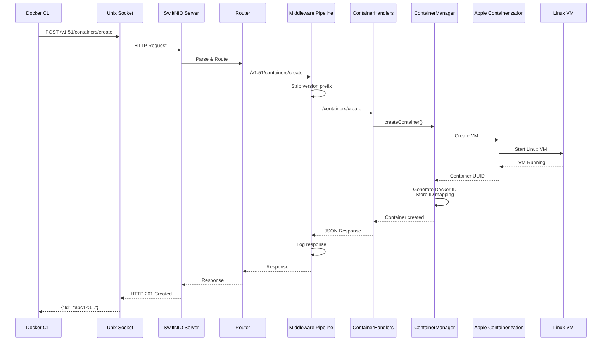

## Networking Architecture

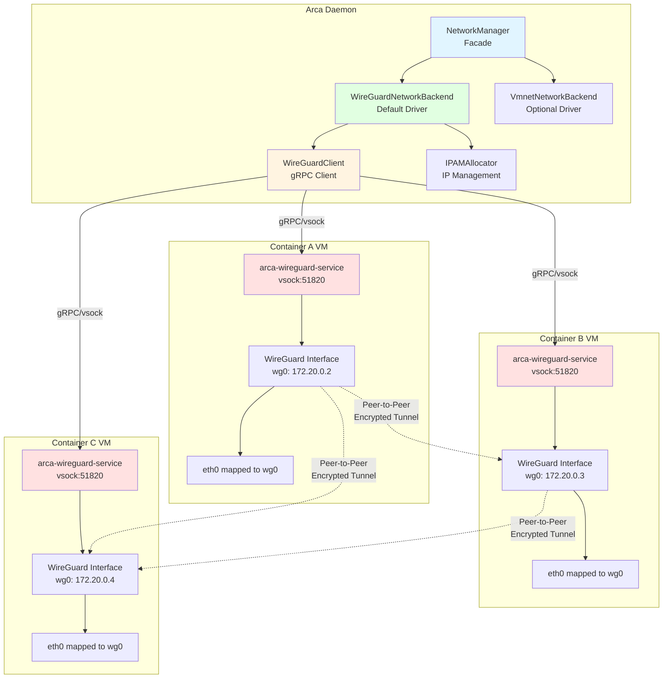

### WireGuard Full Mesh Topology

Each container on a network has WireGuard peers to all other containers on that network:

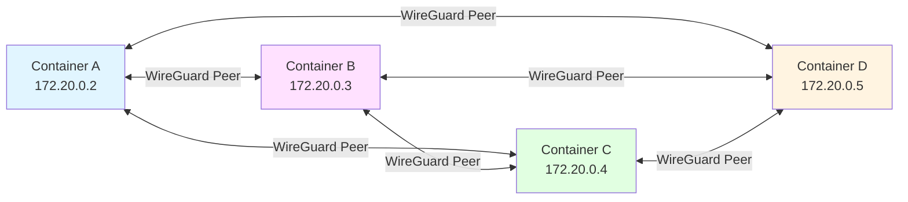

## Volume Architecture

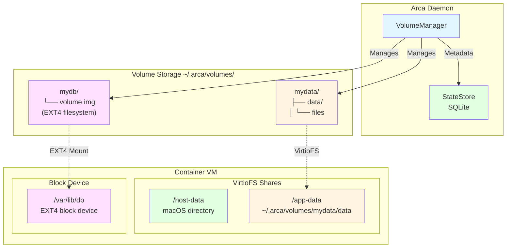

### Volume Driver Comparison

| Feature | Local Driver (Default) | Block Driver (Optional) |
|---------|----------------------|------------------------|
| **Storage** | VirtioFS directory | EXT4 block device |
| **Location** | `~/.arca/volumes/{name}/data/` | `~/.arca/volumes/{name}/volume.img` |
| **Sharing** | ✅ Multiple containers | ❌ Exclusive access |
| **Use Case** | General purpose | Databases, high I/O |
| **Performance** | Good | Better for heavy I/O |
| **Creation** | `docker volume create mydata` | `docker volume create --driver block mydata` |

## Container Persistence

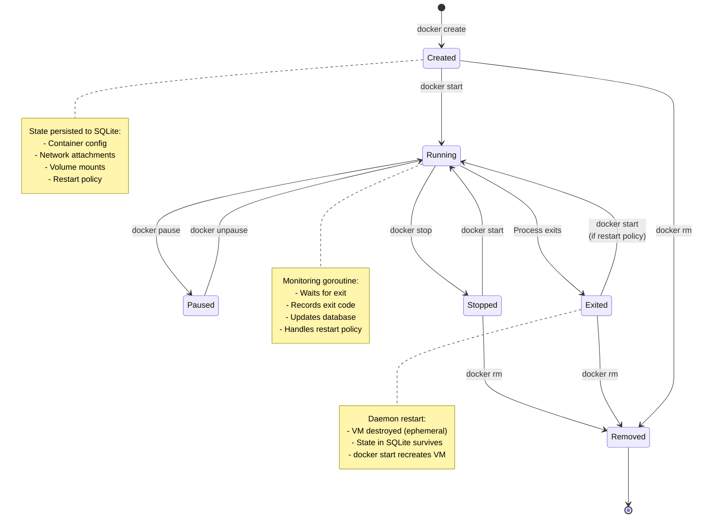

### Restart Policy Behavior

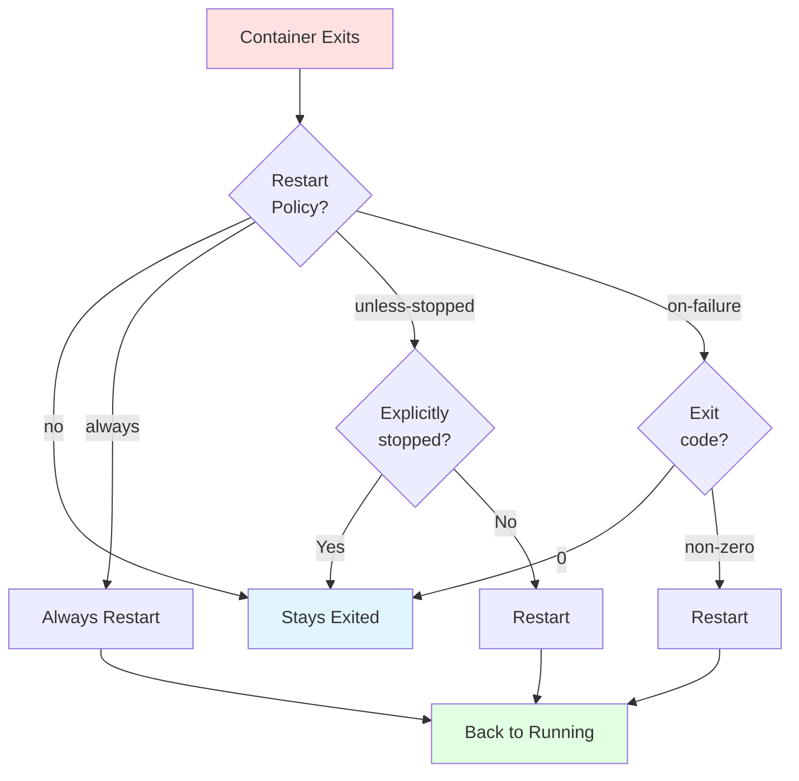

## Image Management

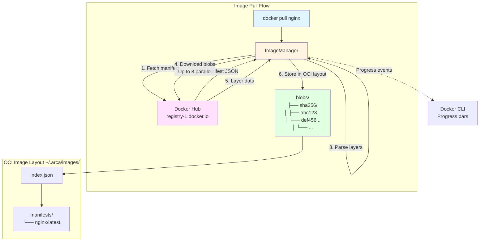

### Image Progress Reporting

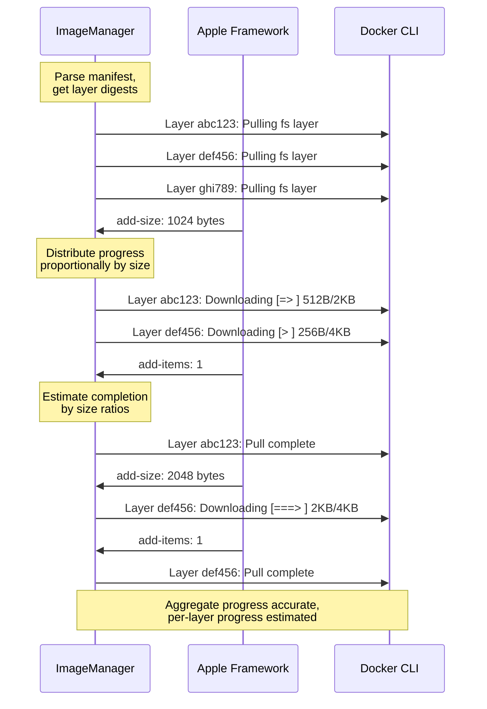

### Container Root Filesystem

A pulled image is stored as layers, but a container never sees them as separate
devices. **The host composes every layer of an image into one ext4 filesystem and
attaches that single block device**, plus one writable layer for the container.
The image therefore contributes exactly one block device whatever its layer count
— the same for a one-layer image and a thirty-five-layer one.

```
<state-root>/image-rootfs/<image-digest>/<os>-<arch>/rootfs.ext4   shared, one per image+platform
<image-store>/containers/<container-id>/writable.ext4              private, one per container
```

`<image-digest>` has its `:` rewritten to `-`, so the directory is
`sha256-<hex>` and not `sha256:<hex>` — `rootfsPath(forImageDigest:platform:)` does
that rewrite, and a reader looking for the literal digest on disk will not find it.

`ImageRootfsUnpacker` (`Sources/ContainerBridge/ImageRootfsUnpacker.swift`) owns
the first of those. The second is `ContainerManager.writableLayer(at:sizeInBytes:)`.
Upstream's `LinuxContainer` stacks them inside the guest — the image rootfs as the
overlay's lower layer, the writable layer as its upper — so a container's writes
land in its own file rather than the shared one.

That last property is a consequence of always passing a writable layer, not
something the shared file enforces. Upstream strips `"ro"` from the rootfs mount
before attaching it, so the device reaches the guest writable; a caller that passed
no writable layer would get the shared slot mounted read-write.
`ImageRootfsUnpacker.blockMount(at:)` records the mechanism and what stays open.

The cache is keyed on **image digest plus `os` and `architecture`**, not on the digest
alone: a multi-platform image has one index digest and a different layer set per
platform, so a digest-only key would hand an arm64 rootfs to an amd64 request. The key
does **not** include the platform `variant`, so `linux/arm/v6` and `linux/arm/v7` would
share a slot -- unreachable while `detectSystemPlatform()` emits no variant, and a thing
to fix before arca honours `--platform`.

Two properties of that cache are load-bearing and are worth knowing before
changing it:

- **The slot is created only by a promotion.** The unpack writes to a sibling
  staging path and is `rename(2)`d onto the slot only after it is verified. An
  unpack that fails leaves no slot for a later create to mistake for a cache hit.
  `Documentation/EVIDENCE-layer-cache-poisoning.md` records why, with the
  measurements.
- **A second container from the same image skips the unpack.** That is the benefit
  the earlier per-layer cache bought, and keying the slot per image rather than per
  container is what preserves it.

**Historical note.** Arca previously ran a fork-local design that unpacked each
layer into its own ext4 and attached one block device per layer, composing the
overlay inside the guest at boot. It capped images at roughly 24 layers, because
the engine allocates block device tags from a 26-letter alphabet, and that ceiling
is why it was reverted to upstream's model.

The host side of it is gone from this repository, and so is the guest side. The
guest-side boot code went out with the submodule pointer bump — `b325bc5`, which moved
the pointer from `6304122` to `a5803b6` — removing 343 lines from
`vminitd/Sources/VminitdCore` (`ArcaBoot.swift`, `AgentCommand.swift`,
`Server+GRPC.swift`, per `git diff --numstat 6304122 a5803b6`). `ArcaBoot` retains only
`startServices(log:)`.

**That guest code has not been executed by anything, and the ceiling is NOT yet proven
gone.** All 343 removed lines sit inside `#if os(Linux)`, which macOS compiles none of,
and cross-compiling is unavailable on the development host (the installed Static Linux SDK
carries only an x86_64 slice). Nothing in this repository can settle it. It gets verified
by the 35-layer workspace image creating and running against a released engine, and by
that alone — never by a unit test asserting a device count. The test that used to make
that assertion was deleted for exactly this reason.

## Container Lifecycle Integration

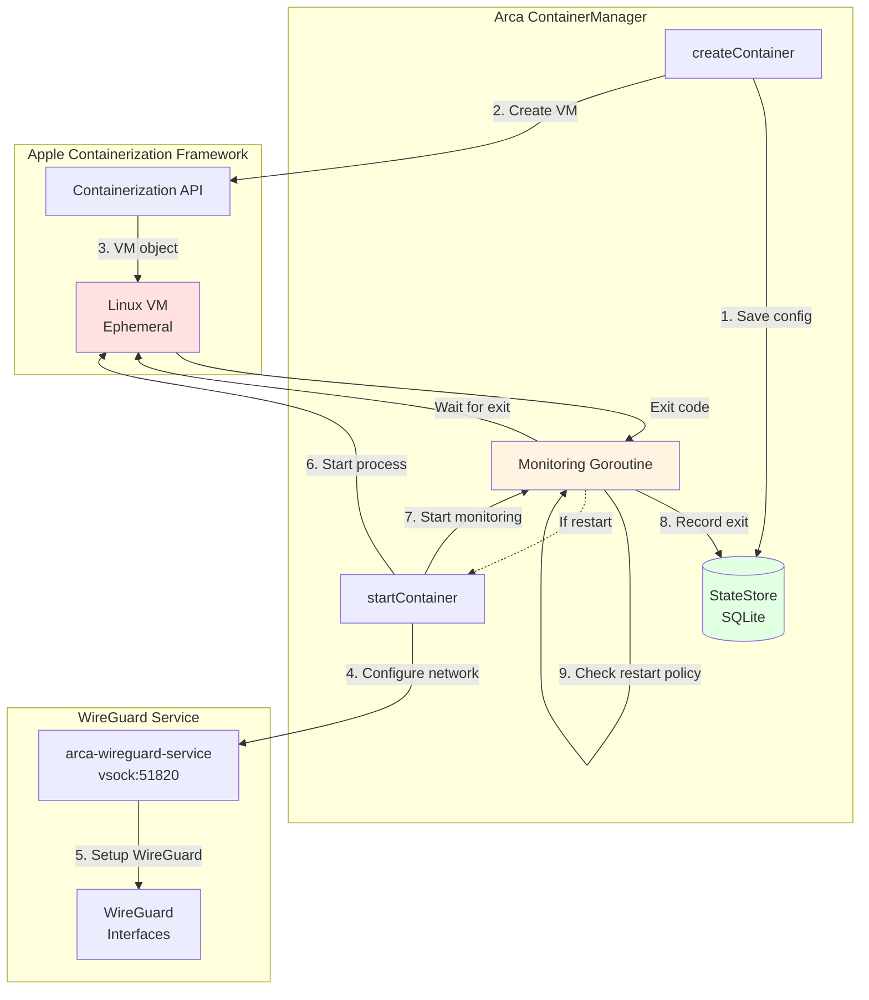

## vminitd Custom Fork

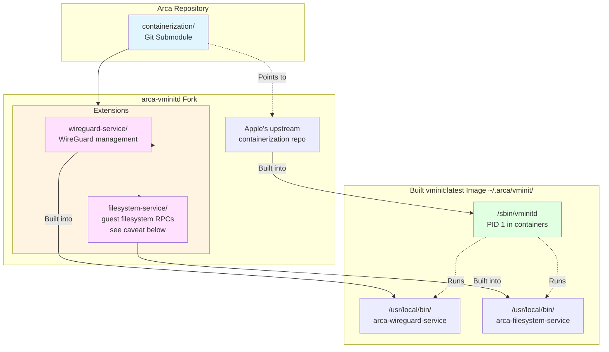

**Caveat on `filesystem-service`.** The binary is built and shipped and serves ten
RPCs — `Ready`, `SyncFilesystem`, `EnumerateUpperdir`, `ReadArchive`,
`WriteArchive`, `CreateBindMount`, `StatPath`, `CreateVolumeOverlay`,
`CreateDirectMount` and `GenerateHostsFile`, per the method descriptors in
`Sources/ContainerBridge/Generated/filesystem.grpc.swift`.
**Two of them are OverlayFS-based, and those two do not work** — and did not
work before the revert to a single composed rootfs either. They are broken in
different ways, not one way. Verified against
`git show a5803b6:vminitd/extensions/arca-services/internal/filesystem/filesystem.go`, the
pinned submodule object. The file is **byte-identical at `6304122` and `a5803b6`**
(`git diff --stat 6304122 a5803b6 --` over that path is empty), so the offsets below hold
at both pointers — the revert does not touch this Go tree:

- `EnumerateUpperdir`, which `docker diff` reaches, looks for `/mnt/vdb/upper`
  (`:151`) and answers `upperdir not found at /mnt/vdb/upper` (`:157`) when it is
  absent. The fork's guest-side overlay mounted at `/mnt/writable`, so that path
  never resolved.
- `CreateVolumeOverlay` has **no hand-written caller** — every reference to it under
  `Sources/` is in `Sources/ContainerBridge/Generated/` — so it is unreachable rather
  than observed failing. Its `/proc/mounts` scan for a literal `/dev/vdb` is in
  `findWritableMountPath()`, which `CreateDirectMount` also calls, so that scan is **not**
  evidence about this RPC specifically; unreachability is the whole of the evidence here.

The revert changes which way this subsystem is broken, not whether it is. Wiring
named volumes and `docker diff` onto the single composed rootfs is separate work.

**Also not done, and named here so it is an absence rather than an oversight:** nothing
evicts the per-image rootfs cache. `docker rmi` removes the image; its
`<root>/image-rootfs/sha256-<digest>/<os>-<arch>/rootfs.ext4` stays on disk indefinitely.
`ImageManager` never sees the cache path, and `LayerCacheReclaim` deletes only the
orphaned `layers` tree. This is not a regression -- the `layer_cache` table this revert
drops had no production caller that evicted anything either -- but the revert is the point
at which even the accounting for it went away.

## HTTP Streaming

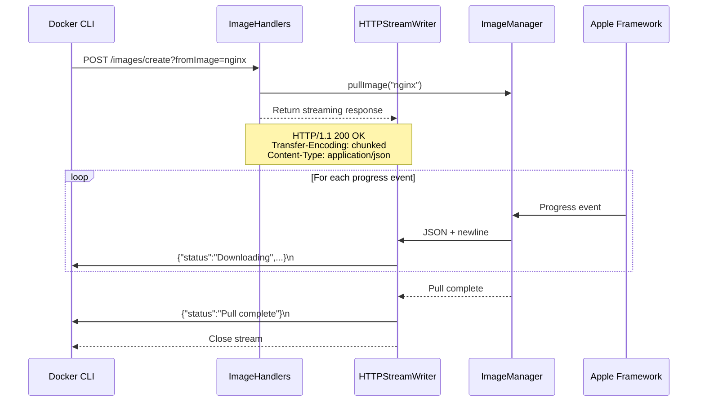

## Code Signing & Entitlements

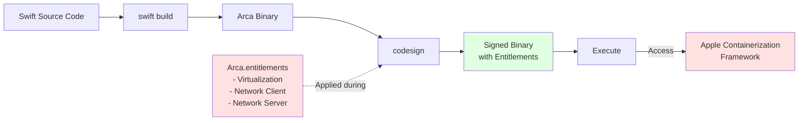

## Performance Characteristics

| Component | Metric | Value | Notes |
|-----------|--------|-------|-------|
| **Container Startup** | Time | 1-3 seconds | VM initialization overhead |
| **Memory per Container** | RAM | 50-100 MB | VM overhead vs namespace isolation |
| **Network Latency** | WireGuard | ~1 ms | Peer-to-peer tunnels |
| **Network Latency** | vmnet | ~0.5 ms | Native Apple networking |
| **Image Pull** | Parallelism | 8 concurrent | Apple's parallel downloader |
| **Image Storage** | Type | Content-addressable | Layer deduplication |

## Key Design Decisions

### 1. WireGuard for Default Networking
**Why?** Full Docker API compatibility, dynamic network operations, multi-network support
**Trade-off:** Slightly higher latency (~1ms vs ~0.5ms for vmnet) but much more flexible

### 2. Container Persistence via SQLite
**Why?** Containers survive daemon restarts, Docker-compatible behavior
**Trade-off:** Added complexity, database maintenance

### 3. VirtioFS for Default Volumes
**Why?** Simple, reliable, shareable across containers
**Trade-off:** Some filesystem features limited vs native Linux

### 4. Buildx Integration (Not Custom Build API)
**Why?** Full feature coverage, zero maintenance, future-proof
**Trade-off:** Requires buildx installed, can't customize build internals

### 5. VM per Container (Apple's Model)
**Why?** Strong isolation, required by Apple's framework
**Trade-off:** Higher resource usage vs namespace-based containers

### 6. One Composed Rootfs per Image (Upstream's Model)
**Why?** A block device per layer exhausts the engine's 26-letter device alphabet at
roughly 24 layers, and it is fork-local divergence from upstream Containerization
**Trade-off:** The first create for an image stacks every layer serially where the
fork unpacked them in parallel (`EXT4Unpacker.unpack` at `a5803b6` is a serial
`for (index, resolved) in resolvedLayers.enumerated()`; the fork's
`OverlayFSUnpacker` used a `withThrowingTaskGroup` with a stated concurrency limit of 3,
read at `6ede1d5`). The fork's unpack measured
`duration_seconds=14.83 layers=36` on 2026-08-21, on host `newcombe`, with the engine
built from arca `c545612`, against the gascan workspace image — the same run that produced
`no free indices are available for allocation`. The **36** is the engine's own log field,
quoted as emitted; the image is described elsewhere in this repository as 35 layers, and
nothing in this tree explains the difference of one. Do not reconcile the two by arithmetic
— re-derive both from a run. The composed equivalent has not been measured,
and the number belongs here once it is

## Development Architecture

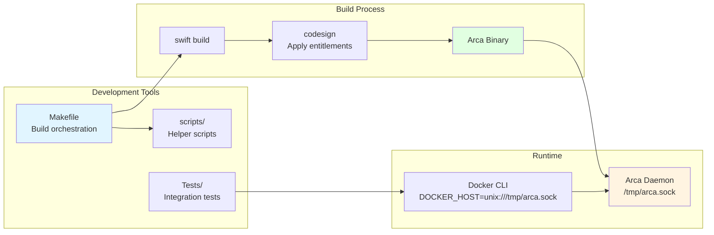

---

For more information, see:
- **DISTRIBUTION.md** - Build and release process
- **VMINIT_BUILD.md** - Building custom vminit
- **Source code** - `Sources/` directories with inline documentation
